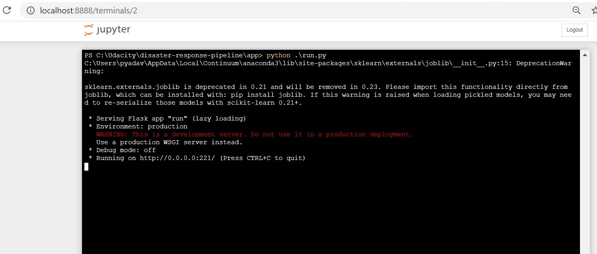

# Disaster-Response-Pipelines
Udacity Nanodegree Project

## 1. Project Overview

In this project, data engineering is applied to analyze disaster data from <a href="https://www.figure-eight.com/" target="_blank">Figure Eight</a> to build a GridSearch model for a dataset that classifies disaster messages and publishes via online application.

_data_ directory contains a data set which are real messages that were sent during disaster events.This project will include a web app where when a new message is input, will publish classification results in several categories. The web app will also display visualizations of the data.

[Here](#eg) are a few screenshots of the web app.

<a id='components'></a>

## 2. Project Components

There are three components of this project:

<a id='etl_pipeline'></a>

### 2.1. ETL Pipeline

File _data/process_data.py_ contains data cleaning pipeline that:

- Loads the `messages` and `categories` dataset
- Merges the two datasets
- Cleans the data
- Stores it in a **SQLite database**

<a id='ml_pipeline'></a>

### 2.2. ML Pipeline

File _models/train_classifier.py_ contains machine learning pipeline that:

- Loads data from the **SQLite database**
- Splits the data into training and testing sets
- Builds a text processing and machine learning pipeline
- Trains and tunes a model using GridSearchCV
- Outputs result on the test set
- Exports the final model as a pickle file

<a id='flask'></a>

### 2.3. Flask Web App

<a id='eg'></a>

Running [this command](#com) **from app directory** will start the web app where users can enter their query, i.e., a request message sent during a natural disaster, e.g. _"Please, we need tents and water. We are in Silo, Thank you!"_.

**_Screenshot 1_**


What the app will do is that it will classify the text message into categories so that appropriate relief agency can be reached out for help.

**_Screenshot 2_**


<a id='run'></a>

## 3. Execution

There are three steps to get up and runnning with the web app if you want to start from ETL process.

<a id='cleaning'></a>

### 3.1. Data Cleaning

**Go to the project directory** and the run the following command:

```bat
python data/process_data.py data/disaster_messages.csv data/disaster_categories.csv data/DisasterResponse.db
```

The first two arguments are input data and the third argument is the SQLite Database in which we want to save the cleaned data. The ETL pipeline is in _process_data.py_.

_DisasterResponse.db_ already exists in _data_ folder but the above command will still run and replace the file with same information. 

**_Screenshot 3_**


<a id='training'></a>

### 3.2. Training Classifier

After the data cleaning process, run this command **from the project directory**:

```bat
python models/train_classifier.py data/DisasterResponse.db models/classifier.pkl
```

This will use cleaned data to train the model, improve the model with grid search and saved the model to a pickle file (_classifer.pkl_).

_classifier.pkl_ already exists but the above command will still run and replace the file will same information.

_**Screenshot 4**_


When the models is saved, it will look something like this.

<a id='acc'></a>

**_Screenshot 5_**


<a id='starting'></a>

### 3.3. Starting the web app

Now that we have cleaned the data and trained our model. Now it's time to see the prediction in a user friendly way.

**Go the app directory** and run the following command:

<a id='com'></a>

```bat
python run.py
```

**_Screenshot 6_**



This will start the web app and will direct you to a URL where you can enter messages and get classification results for it as below:

**_Screenshot 7_**


<a id='conclusion'></a>

**_Screenshot 8_**


## 5. Files

### app
- run.py: FLASK FILE THAT RUNS APP</b>
- static/favicon.ico: FAVICON FOR THE WEB APP</b>
- templates/go.html: CLASSIFICATION RESULT PAGE OF WEB APP</b>
- templates/master.html: MAIN PAGE OF WEB APP</b>

### data
- DisasterResponse.db - DATABASE TO SAVE CLEANED DATA</b>
- disaster_categories.csv - DATA TO PROCESS</b>
- disaster_messages.csv - DATA TO PROCESS</b>
- process_data.py - PERFORMS ETL PROCESS</b>

### screenshots
- images of various plots, main web app look, result and command prompt run output</b>

### model
train_classifier.py - PERFORMS CLASSIFICATION TASK</b>

## 6. Software Requirements

- Flask==1.0.2</b>
- nltk==3.4</b>
- numpy==1.15.4</b>
- pandas==0.22.0</b>
- plotly==3.4.2</b>
- scikit-learn==0.20.1</b>
- SQLAlchemy==1.2.14</b>
